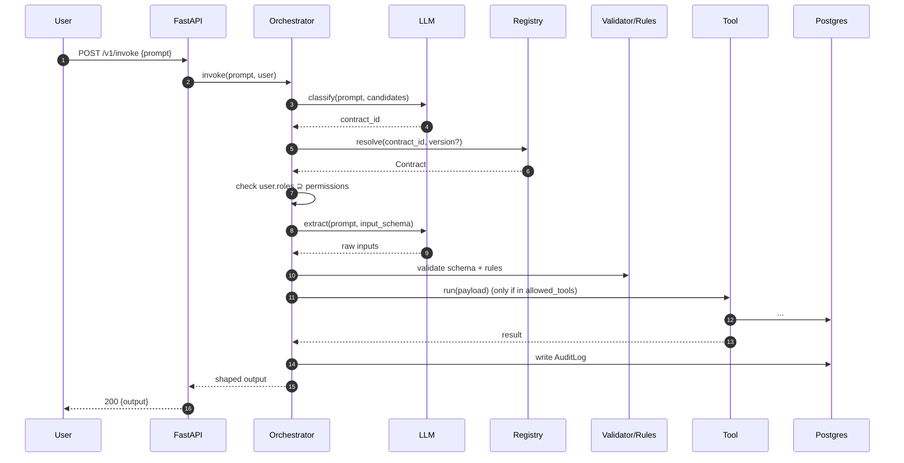

# Architecture

PCA is a runtime sandwiched between clients and tools/services. Every
invocation is gated by a contract.

## Runtime Pipeline

## Modules

| Module | Responsibility |
|---|---|
| `pca.contracts` | YAML schema, loader, registry (hot reload), static validator |
| `pca.runtime` | Orchestrator, classifier, schema builder, rules |
| `pca.llm` | Provider protocol + LiteLLM and Mock implementations |
| `pca.tools` | Tool protocol + registry + built-ins |
| `pca.auth` | JWT decode + FastAPI dependencies |
| `pca.audit` | Persistent audit log |
| `pca.api` | FastAPI routers (`/v1/invoke`, `/v1/contracts`, `/v1/audit`, `/v1/docs`, `/v1/tests`) |
| `pca.docs_gen` | Contract → Markdown |
| `pca.test_gen` | Contract → in-memory test cases + executor |
