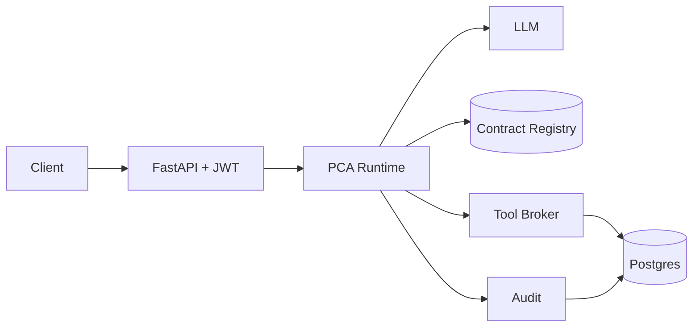

# Prompt Contract Architecture (PCA)

> **Make prompts first-class software artifacts.**

PCA sits between users and backend services. A YAML **Prompt Contract**
becomes the source of truth for intent, inputs, validation, authorization,
tool access, output schema, audit, docs, and tests.

See [Architecture](architecture.md) and [Contracts](contracts/index.md).
